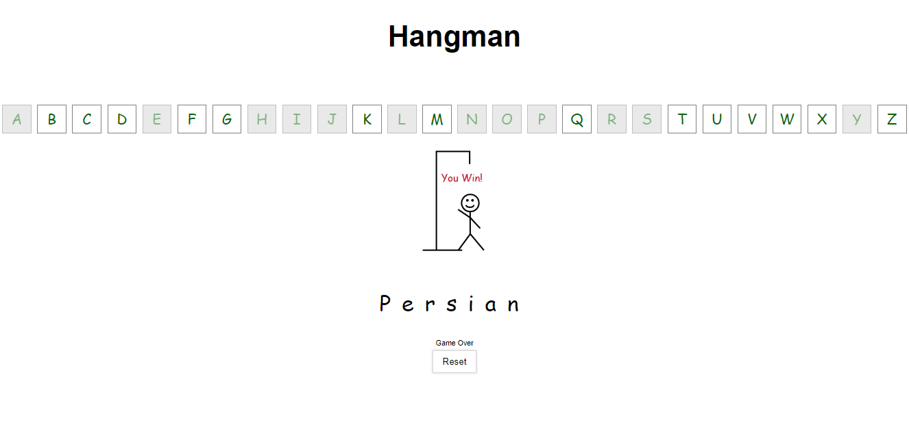

# Hangman
🔎 About Hangman Game :
Hangman is a word game in which one player has to guess a word that the other player (the computer in this case) has thought of, by guessing the letters in it. Every time the player guesses a wrong letter, the rope that's tightening the man will get pulled by a tiny bit, until it gets completely pulled and the man is hanged. The player has to make the right guesses before the rope gets completely pulled to win the game.

## 👀 𝗣𝗿𝗲𝘃𝗶𝗲𝘄

## ⚙️ 𝗧𝗲𝗰𝗵𝗻𝗼𝗹𝗼𝗴𝗶𝗲
*   Vanilla Js

## Author
- [@Pardis-h](https://github.com/Pardis-h)
