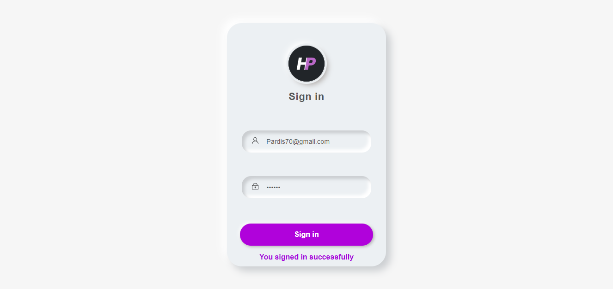

# SingInFormValidation
🔎 About: Responsive Sign In Form with Validation

## 👀 𝗣𝗿𝗲𝘃𝗶𝗲𝘄

## ⚔️ 𝐓𝐡𝐞 𝐜𝐡𝐚𝐥𝐥𝐞𝐧𝐠𝐞
- [x]  send data with fetch to API and show success message

Receive an error message when the form is submitted if:
- [x]  Any input field is empty
- [x]  Check the Lengths
- [x]  The email address is not formatted correctly     

## ⚙️ 𝗧𝗲𝗰𝗵𝗻𝗼𝗹𝗼𝗴𝗶𝗲
*   Css
*   Vanilla Js

## Author
- [@Pardis-h](https://github.com/Pardis-h)
